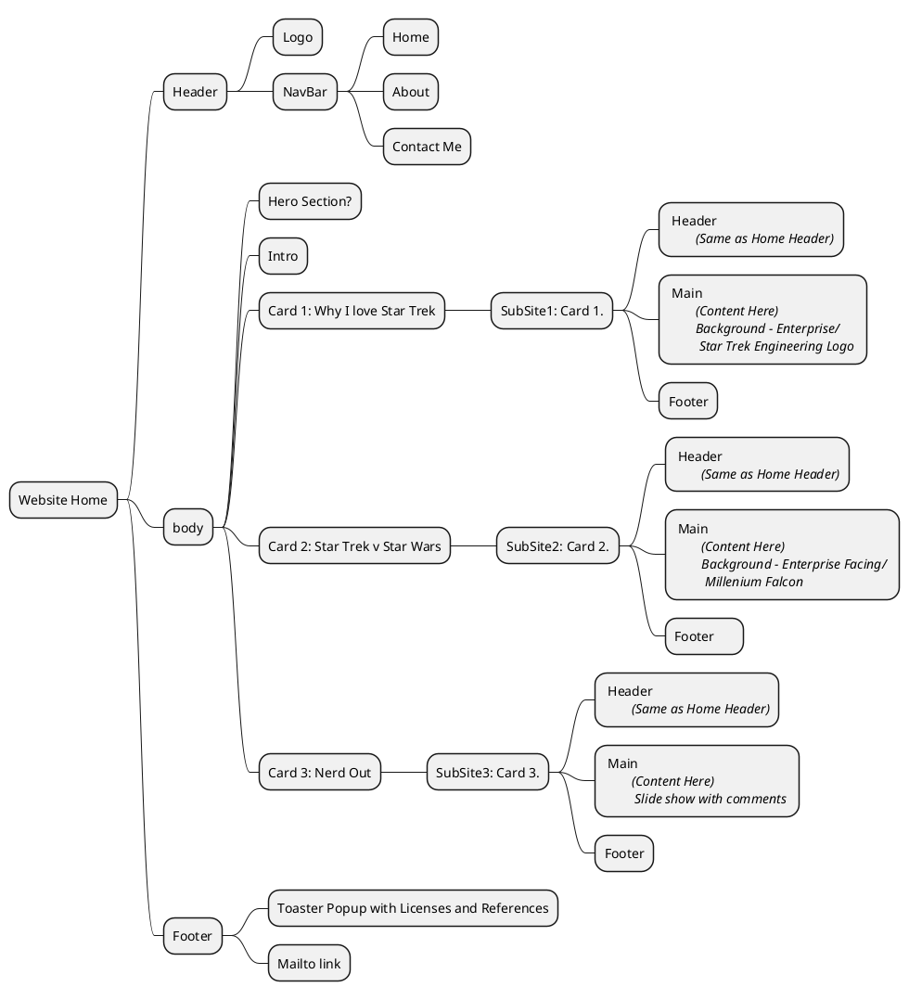

# Scribbles and Plans
## Outline:
A Central document from which to Document and record some of the ideas for the web-page and plans to implement.

The Brief can be explained as:

!!! Quote Brief
    Design, develop and publish a responsive web site using recommended design practices. Your web site will contain a home page and three content pages. Create an external style sheet (.css file) that configures text, colour and layout. No font tags, embedded CSS or inline CSS is allowed. You must publish your project to the Internet. 
    Your website must be on one of the following topics: 
    - Sport 
    - Music 
    - Comedy 
    - Any other topic that provides substantial, relevant, and clearly structured content

For this, I think I will use "Star Trek".

Plan:
---
```plantuml
@startgantt
    project starts 2026-07-08
    today is coloured in #AAFFAA
    [<color:red>Submission Deadline] happens at 2026-07-22 and is coloured in red
    [Develop Content] as [T1] starts 2026-07-08 and ends at 2026-07-12
    [Outline Structure] as [T2] starts 2026-07-08 and requires 3 days
    [T2] pauses at 2026-07-09 to 2026-07-11
    [Code Index.HTML] as [T3] starts at [T1]'s end and requires 2 days
    [T2] --> [T3]
    [Stylesheet] as [T4]starts at [T3]'s end and requires 2 days
    [Update and Adjust] as [T5] starts at [T4]'s end
    [Validate HTML] as [T6] starts at [T5]'s Start
    [Validate CSS] as [T7] starts at [T6]'s end
    [Document outline] starts at [T1]'s start and ends 2 days after [T7]'s end


    [T1] is 90% complete
    [T2] is 60% complete
    [T3] is 0% complete
    [T4] is 0% complete
    [T5] is 0% complete
    [T6] is 0% complete
    [T7] is 0% complete
    [Document outline] is 10% complete

@endgantt
```

Star Trek
Why I love the Enterprise

Home:   The home landing page. Index.html
About:  About me.
Contact Me: EMail Contact form for me.

Main page:
Space, The final frontier
These are the voyages of the Starship Enterprise
It's mission...

Pic of Enterprise D in background.

Outline
---
Card A:     Why I Love Star Trek

Card B:     Star Trek V Star Wars

Card C:     Nerd Out

### Page A: Why I love Star Trek
When I was ~12, I used to come home from School and on Sky One, every day was Star Trek, The Next Generation.
I Liked it, Grew to Love it and watched it on syndication from Start to Finish, More than once.
The Crew of the Enterprise.
Like the intro, "To explore Strange new worlds, to seek out new Life and New Civilisations, to Boldly go where no-one had gone before", the enterprise didn't just float around in space, it encountered Strange new worlds, and Strange beings to spark the imagination and start asking questions.
Beings like Q, The Dowd, Changelings, Armus.  Encountering Objects like Tin-Man (Gomtu), Farpoint station and Time Loops and almost all were grounded in Pseudo-science.  Not the science of today, but the Science of the future (With a more than a little topping of poetic license and Deus-Ex-Machina).
This was my introduction to Engineering. Watching Geordi LaForge and Mister Data Bailing the Enterprise and its crew out of troubles again and again.
If it were a diplomatic Mission, Picard had the Nous to address.  If it were Battle stations, Mister Worf and Riker were key and Dr. Crusher (And Dr. Pulaski for a Season) was there to resolve any medical / bilogical issues but none of it was possible without the fantastic technology and engineering of the Enterprise and it's fancy equipment, all maintained and run by Mister Data and LaForge.

An Introduction would put the enterprise in a strange new location, then a challenge, a crisis.  What was going on.  Science, under the supervision of the team and Mister Data would evaluate and hypothesise and then work with Engineering with Mr. Laforge to Determine a series of possible solutions.
A Brief to Picard and Riker would decide and the STEM team would deliver, Every time and with only the equipment at hand, knowledge of Science and Engineering and a crew that worked.

I wanted to e a part of it so bad, I had all the questions, how does a Transporter work, how do the Phasers work, how does warp drive work and soaked it all in.  When it came to Deciding a course in college, it was decision paralysis.  All my Friends did Civil Engineering and Construction studies.  One friend did Mechanical Engineering but Like Mister LaForge, i wanted it all, so when I heard the name of the course "Electro-Mechanical Systems", it resonated like a calling and I was hooked.

I wasn't Naieve enough to still believe the world and office worked like it did in the Enterprise but I still took that spirit of endeavour, of investigation and solution into my career and still will until I no longer can. 


### Page B: Star Trek V Star Wars
Many people think of them in the same breath - Star Trek V Star Wars - what's the difference?  My Wife is one of them.  They see a model space ship against a background of stars and think they're the same, but it's the same as saying "Wagon Train" and "lord of the Rings" are the same as they both have horses.

To Elaborate, we can check out the introduction to both.
==Table==
|Star Trek|Star Wars|
|---|---|
|Space, The final Frontier.  These are the voyages of the starship enterprise.  It's continuing Mission, to Explore Strange new worlds, to seek out new life and new civilisations, to Boldy go where no-one has gone before|A Long time ago, in a Galaxy Far, Far Away... |

Star Trek was concieved by Gene Roddenberry as a concept of what human civilisation would look like if we overcame our predjucies and greed and worked together for a united Earth.  To Facilitate this, we encountered Aliens and found ways to commuicate and work together to form the united federation of planets, to work together to explore the Galaxy.

Gene Roddenberry dubbed this almost as a western - "Wagon Train through the Stars" and it shows earth 300 years in the future.  The cast and characters share the same common history as todays people and the tech is based on what was deemed achievable.

By the time Star-Trek The Next Generation started, The production crew had engaged with science Advisors to ensure that any technobabble could be explained with real physics.

Star Wars on the other hand was written by George Lucas to tell a specific political tale removed from reality.  it is set in a different Galaxy Far far away so the physics are detached and though Humans exist, they do not share the same common history.  Star wars tells tales of mystical warrior wizards (Jedi) and their Evil counterparts (The Emperor, Darth Vader).
It is more closely related to lord of the rings or Game of thrones with a fabricated universe, backstory and only is set in space as a setting.

Fans have attempted to provide scientific plausability behind the technology, from the blasters to the Light-Sabers but they are based on fantasy, though through much novels, movies and websites over the 50 years since it debut'ed have set a rich and well developed canon. 

### Page C: Nerd Out
#### Transporters were an accident.
As the first episodes were aired, the budget had not been assigned to build the Shuttlecraft Prop.  To Counter this for the first episodes, the crew used a "Transporter", a magical device that could "Beam" the crew from ship to planet using cheap special effects instead of an expensive prop.
One episode (The Enemy Within) included a crew Member stranded on a planet about to Freeze while the crew tried fixing the transporter and no mention was made to Justsend a shuttle that would have saved him pretty quickly.

### Product of the Era
Star Trek; the original Series, ran from 1966 to 1969, ending before man had set foot on the moon.
This was before the Viking probes landed on mars when we didn't know for certain that there weren't little green men on mars.
This was an age of Studio Execs who had specific demands that shaped the Star Trek we knew today.  These demands can be seen significntly today.

A Pilot Episode "The Cage" was released before the Series was approved for production.
The footage for this pilot was used extensively in the Season 1 double episode "the Menagerie" and the differences in style and structure are evident.  Most of these were a result of Exec interferences.

#### Coloured uniforms and 'computer' screens
The original Set of the Enterprise was styled as any military ship, grey walls, white lights and a simple coloured uniform.  Colour TV was being standardised and the Execs wanted those who had forked out for more expensive colour TVs to feel better about their purchases so a mandate was issued to make the sets more colourful, hence he Different coloured uniforms, Bridge Panels, lights and buttons.

#### Sexism in Plain View
In the Pilot, the enterprise was captained by Captain Christopher Pike and Second in Command was 'Number 1', Una chin Rilley.
Execs (and the test audiences to be fair) did not gel with the idea of a woman in power so she was written out of the cast.  Only three women were on the crew as a staple, Yeoman Janice Rand, Nurse Christine Chapel and the 'Comms Officer' (receptionist) Nyota Uhura, also the only person of non-european descent.

#### Story Interference
The Studio had one significant Constraint when developing the Original Series - "The Status Quo must be maintained"
This was because they wanted to run the episodes in any order they chose, whenever they wanted and people could tune in and watch without having missed anything in other episodes.
This lead to extremely limited Character constraint and many story lines ruined.

In the episode "For the world is Hollow and I have touched the Sky" - Dr. McCoy is diagnosed with a mortal illness that he has to stay on a planet where he has contracted the illness.
To maintain the Status Quo, Kirk (Not a scientist or Doctor) develops a Miracle Cure to completely change the ending for the status quo.

In the Episode "The Apple" The crew of the enterprise encounter a race of innocent child-like beings who are being 'Ruled' by a computer ruler.
At the end of the episide, Kirk disobeys the non interference prime directive and destroys the computer before telling the people (who don't know how to rule themselves and are full of sorrow at the end of their civilisation) that they are to Celebrate, they are all free, before Setting off to the stars on the starship for another episode.

## Site Map


