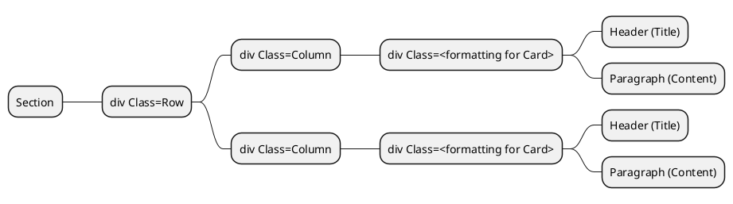

# Scribbles and Plans
## Outline:
A Central document from which to Document and record some of the ideas for the web-page and plans to implement.

The Brief can be explained as:

> [!IMPORTANT] 
> "Brief"
> Design, develop and publish a responsive web site using recommended design practices. Your web site will contain a home page and three content pages. Create an external style sheet (.css file) that configures text, colour and layout. No font tags, embedded CSS or inline CSS is allowed. You must publish your project to the Internet. 
>    Your website must be on one of the following topics: 
>    - Sport 
>    - Music 
>    - Comedy 
>    - Any other topic that provides substantial, relevant, and clearly structured content

### Website Goal
To probide an accessible responsive static website that conveys a point of interest for me that I can publish.

Plan:
---


## Goal
to Create a Static web page as a homage to Star Trek.
The Goal is to provide a website that meets all of the criteria for the module 1 assessment for the UCD Full Stack Development course.

Home:   The home landing page. Index.html
About:  About me.
Contact Me: EMail Contact form for me.

Main page:
Space, The final frontier
These are the voyages of the Starship Enterprise
It's mission...

Pic of Enterprise D in background.

Outline
---
Card A:     Why I Love Star Trek

Card B:     Star Trek V Star Wars

Card C:     Nerd Out

### Page A: Why I love Star Trek
When I was ~12, I used to come home from School and on Sky One, every day was Star Trek, The Next Generation.
I Liked it, Grew to Love it and watched it on syndication from Start to Finish, More than once.
The Crew of the Enterprise.
Like the intro, "To explore Strange new worlds, to seek out new Life and New Civilisations, to Boldly go where no-one had gone before", the enterprise didn't just float around in space, it encountered Strange new worlds, and Strange beings to spark the imagination and start asking questions.
Beings like Q, The Dowd, Changelings, Armus.  Encountering Objects like Tin-Man (Gomtu), Farpoint station and Time Loops and almost all were grounded in Pseudo-science.  Not the science of today, but the Science of the future (With a more than a little topping of poetic license and Deus-Ex-Machina).
This was my introduction to Engineering. Watching Geordi LaForge and Mister Data Bailing the Enterprise and its crew out of troubles again and again.
If it were a diplomatic Mission, Picard had the Nous to address.  If it were Battle stations, Mister Worf and Riker were key and Dr. Crusher (And Dr. Pulaski for a Season) was there to resolve any medical / bilogical issues but none of it was possible without the fantastic technology and engineering of the Enterprise and it's fancy equipment, all maintained and run by Mister Data and LaForge.

An Introduction would put the enterprise in a strange new location, then a challenge, a crisis.  What was going on.  Science, under the supervision of the team and Mister Data would evaluate and hypothesise and then work with Engineering with Mr. Laforge to Determine a series of possible solutions.
A Brief to Picard and Riker would decide and the STEM team would deliver, Every time and with only the equipment at hand, knowledge of Science and Engineering and a crew that worked.

I wanted to e a part of it so bad, I had all the questions, how does a Transporter work, how do the Phasers work, how does warp drive work and soaked it all in.  When it came to Deciding a course in college, it was decision paralysis.  All my Friends did Civil Engineering and Construction studies.  One friend did Mechanical Engineering but Like Mister LaForge, i wanted it all, so when I heard the name of the course "Electro-Mechanical Systems", it resonated like a calling and I was hooked.

I wasn't Naieve enough to still believe the world and office worked like it did in the Enterprise but I still took that spirit of endeavour, of investigation and solution into my career and still will until I no longer can. 


### Page B: Star Trek V Star Wars
Many people think of them in the same breath - Star Trek V Star Wars - what's the difference?  My Wife is one of them.  They see a model space ship against a background of stars and think they're the same, but it's the same as saying "Wagon Train" and "lord of the Rings" are the same as they both have horses.

To Elaborate, we can check out the introduction to both.
==Table==
|Star Trek|Star Wars|
|---|---|
|Space, The final Frontier.  These are the voyages of the starship enterprise.  It's continuing Mission, to Explore Strange new worlds, to seek out new life and new civilisations, to Boldy go where no-one has gone before|A Long time ago, in a Galaxy Far, Far Away... |

Star Trek was concieved by Gene Roddenberry as a concept of what human civilisation would look like if we overcame our predjucies and greed and worked together for a united Earth.  To Facilitate this, we encountered Aliens and found ways to commuicate and work together to form the united federation of planets, to work together to explore the Galaxy.

Gene Roddenberry dubbed this almost as a western - "Wagon Train through the Stars" and it shows earth 300 years in the future.  The cast and characters share the same common history as todays people and the tech is based on what was deemed achievable.

By the time Star-Trek The Next Generation started, The production crew had engaged with science Advisors to ensure that any technobabble could be explained with real physics.

Star Wars on the other hand was written by George Lucas to tell a specific political tale removed from reality.  it is set in a different Galaxy Far far away so the physics are detached and though Humans exist, they do not share the same common history.  Star wars tells tales of mystical warrior wizards (Jedi) and their Evil counterparts (The Emperor, Darth Vader).
It is more closely related to lord of the rings or Game of thrones with a fabricated universe, backstory and only is set in space as a setting.

Fans have attempted to provide scientific plausability behind the technology, from the blasters to the Light-Sabers but they are based on fantasy, though through much novels, movies and websites over the 50 years since it debut'ed have set a rich and well developed canon. 

### Page C: Nerd Out
#### Transporters were an accident.
As the first episodes were aired, the budget had not been assigned to build the Shuttlecraft Prop.  To Counter this for the first episodes, the crew used a "Transporter", a magical device that could "Beam" the crew from ship to planet using cheap special effects instead of an expensive prop.
One episode (The Enemy Within) included a crew Member stranded on a planet about to Freeze while the crew tried fixing the transporter and no mention was made to Justsend a shuttle that would have saved him pretty quickly.

### Product of the Era
Star Trek; the original Series, ran from 1966 to 1969, ending before man had set foot on the moon.
This was before the Viking probes landed on mars when we didn't know for certain that there weren't little green men on mars.
This was an age of Studio Execs who had specific demands that shaped the Star Trek we knew today.  These demands can be seen significntly today.

A Pilot Episode "The Cage" was released before the Series was approved for production.
The footage for this pilot was used extensively in the Season 1 double episode "the Menagerie" and the differences in style and structure are evident.  Most of these were a result of Exec interferences.

#### Coloured uniforms and 'computer' screens
The original Set of the Enterprise was styled as any military ship, grey walls, white lights and a simple coloured uniform.  Colour TV was being standardised and the Execs wanted those who had forked out for more expensive colour TVs to feel better about their purchases so a mandate was issued to make the sets more colourful, hence he Different coloured uniforms, Bridge Panels, lights and buttons.

#### Sexism in Plain View
In the Pilot, the enterprise was captained by Captain Christopher Pike and Second in Command was 'Number 1', Una chin Rilley.
Execs (and the test audiences to be fair) did not gel with the idea of a woman in power so she was written out of the cast.  Only three women were on the crew as a staple, Yeoman Janice Rand, Nurse Christine Chapel and the 'Comms Officer' (receptionist) Nyota Uhura, also the only person of non-european descent.

#### Story Interference
The Studio had one significant Constraint when developing the Original Series - "The Status Quo must be maintained"
This was because they wanted to run the episodes in any order they chose, whenever they wanted and people could tune in and watch without having missed anything in other episodes.
This lead to extremely limited Character constraint and many story lines ruined.

In the episode "For the world is Hollow and I have touched the Sky" - Dr. McCoy is diagnosed with a mortal illness that he has to stay on a planet where he has contracted the illness.
To maintain the Status Quo, Kirk (Not a scientist or Doctor) develops a Miracle Cure to completely change the ending for the status quo.

In the Episode "The Apple" The crew of the enterprise encounter a race of innocent child-like beings who are being 'Ruled' by a computer ruler.
At the end of the episide, Kirk disobeys the non interference prime directive and destroys the computer before telling the people (who don't know how to rule themselves and are full of sorrow at the end of their civilisation) that they are to Celebrate, they are all free, before Setting off to the stars on the starship for another episode.

### Reconfigure the power couplings
When the next genertion was started in 1987, the production crew took a much more realistic view of the Science of Star trek and had scientific advisors on-board.
The Warp Engines were based on a theory by Miguel Alcubierre in 1994 and the physics behind this were used in the Series, but with some poetic license based on what wasn't known.

#### Heisenberg Compensators
Heisenbergs Uncertainty Principle states how you cannot measure the exact location and Speed of a particle at the same time.  Once you measure one, the other becomes fuzzy.  This is a big hindrance to a Transporter, which "Teleports" people and equipment instantaneously across space across a beam, one atom at a time.
The answer was to refer to a fictional device called a "Heisenberg compensator" during episedes where the transporter would malfuntion, but the device was simply a plot device and nobody had a clue how it would work.
The Special effects team would get calls asking "How does the Heisenberg Compensators work?" and they would answer "They work Just fine, thank you" (Ref Youtube)[https://www.youtube.com/watch?v=ldZ0KAtVZqc&t=109s]

#### Self Sealing Stem Bolts
Used, again as a plot device during an episode of Star-trek Deep Space nine called "Progress" as a comodity to be traded and even a prop was developed for the device, but nobody knows what they actually are, though they have popped up repeatedly in other series, almost as an in-joke.

#### Ultimate Engineering Fix
When the Enterprise is in trouble and things aren't working, Geordi LaForge can often be found mentioning how he needs to "reconfigure the power couplings" as a fix.  This is used often in the show, in battle or during investigations.
Reading between the lines, this is a fancy way of saying "Turn it off and on again"

## Assessment:

Students should follow this structure exactly.

**Why this matters**

This order mirrors how assessors will review projects. Following it keeps demos focused and efficient.

### 1\. Project Overview (30–45 seconds)

- What the site is  
- Who it is for  
- What problem it solves

---

### 2\. Live Demo (2–3 minutes)

- Homepage layout  
- Navigation  
- Responsive behaviour  
- Visual consistency

---

### 3\. Accessibility Mention (30–45 seconds)

- Keyboard navigation  
- Semantic HTML  
- Any accessibility improvements made

---

### 4\. GitHub Repository (1 minute)

- Repository structure  
- Commit history  
- README presence (if applicable)

## Site Map


# AI Refrences
AI was used extensively for the development of this project.  I used Google Gemini Search to provide ideas and to fact check some of the items i already had in my head.

The following is a detailed list of references where AI was used:

## Toaster popup

> [!NOTE] 
"toaster css with flexbox no javascript"
> Most of the results through a raw google search provided only bootstrap or Javascript powered solutions so I asked Google Gemini.

This prompt provided the following code:
```HTML
<!-- Toast Container positioned at the bottom-right of the screen -->
<div class="toast-container">
  
  <!-- Success Toast -->
  <div class="toast toast-success">
    <div class="toast-icon">✓</div>
    <div class="toast-content">
      <p class="toast-title">Success</p>
      <p class="toast-message">Your changes have been saved successfully.</p>
    </div>
    <button class="toast-close" onclick="this.parentElement.style.display='none'">×</button>
  </div>

  <!-- Error Toast -->
  <div class="toast toast-error">
    <div class="toast-icon">✕</div>
    <div class="toast-content">
      <p class="toast-title">Error</p>
      <p class="toast-message">An error occurred while uploading your file.</p>
    </div>
    <button class="toast-close" onclick="this.parentElement.style.display='none'">×</button>
  </div>

</div>
```

```css
/* Container for stacking multiple toasts */
.toast-container {
  position: fixed;
  bottom: 20px;
  right: 20px;
  display: flex;
  flex-direction: column;
  gap: 12px; /* Space between notifications */
  z-index: 9999;
  font-family: sans-serif;
}

/* Individual Toast Structure using Flexbox */
.toast {
  display: flex;
  align-items: center; /* Vertically centers the icon, text, and close button */
  width: 340px;
  padding: 16px;
  border-radius: 8px;
  box-shadow: 0 4px 12px rgba(0, 0, 0, 0.15);
  background-color: #fff;
  color: #333;
  
  /* CSS Slide-in Animation */
  animation: slideIn 0.3s ease-out forwards;
}

/* Flexbox Layout Internal Parts */
.toast-icon {
  display: flex;
  align-items: center;
  justify-content: center;
  font-size: 20px;
  font-weight: bold;
  margin-right: 14px;
  flex-shrink: 0; /* Prevents icon from shrinking if text is long */
}

.toast-content {
  flex-grow: 1; /* Forces the text area to fill available horizontal space */
}

.toast-title {
  margin: 0 0 4px 0;
  font-weight: 600;
  font-size: 14px;
}

.toast-message {
  margin: 0;
  font-size: 13px;
  color: #666;
}

.toast-close {
  background: none;
  border: none;
  font-size: 18px;
  color: #999;
  cursor: pointer;
  padding: 0 0 0 10px;
  flex-shrink: 0;
}

.toast-close:hover {
  color: #444;
}

/* Toast Theme Variants */
.toast-success {
  border-left: 5px solid #2ecc71;
}
.toast-success .toast-icon {
  color: #2ecc71;
}

.toast-error {
  border-left: 5px solid #e74c3c;
}
.toast-error .toast-icon {
  color: #e74c3c;
}

/* Slide-in Keyframe from the Right side */
@keyframes slideIn {
  from {
    transform: translateX(110%);
    opacity: 0;
  }
  to {
    transform: translateX(0);
    opacity: 1;
  }
}

```

## Introduction Paragraph
I was struggling to try and develop a clean and concise introduction to star trek.  My Passion is prohibiting me from writing cleanly so I asked Google Gemini:

> [!NOTE] 
> "Give me a brief introduction to star trek to include as a paragraph"
> Created by Gene Roddenberry, Star Trek is an iconic sci-fi franchise set in a hopeful future where humanity has overcome poverty, war, and greed. Centered on the space exploration armada known as Starfleet, the stories follow diverse crews traveling the galaxy in vessels like the USS Enterprise. Their mission is to seek out new life, expand Federation ideals, and boldly go where no one has gone before.

## Image references and sources:
Self Sealing Stem Bolts: https://wiki.fed-space.com/index.php?title=Self-sealing_stem_bolt

Transporter: https://www.cbr.com/star-trek-tos-enterprise-multiple-transporter-rooms/

Studio Execs: https://www.imdb.com/title/tt1118051/mediaviewer/rm4193435136/?ref_=tt_ph_2

Colourful Bridge: https://www.reddit.com/r/GalaxyS23Ultra/comments/1ds4023/this_camera_is_really_amazing/

Enterpise Crew: https://memory-beta.fandom.com/wiki/USS_Enterprise_(NCC-1701)_personnel

Geordi Engineering: https://screenrant.com/star-trek-geordi-la-forge-complete-timeline/

Board Room: http://steveboese.squarespace.com/journal/2015/2/2/i-dont-want-to-work-with-companies-i-want-to-work-with-peopl.html;jsessionid=DD7DAB107068EE6647376468B37BFE2A.v5-web018


Star Trek Engineering Logo: https://imgbin.com/png/fBE69cXG/star-trek-starfleet-command-starship-enterprise-embroidered-patch-png
(Modified in Inkscape)

enterpise Over Promellian battle cruiser: https://cygnus-x1.net/links/lcars/epsd-TNG3-6.php

Star Trek TNG Crew: https://memory-alpha.fandom.com/wiki/Star_Trek:_The_Next_Generation?file=Star_Trek_TNG_cast.jpg

Millenium Falcon Crew: https://www.imdb.com/title/tt0076759/mediaviewer/rm2032570112/?ref_=ttmi_mi_16_2

The original Series crew laughing on the bridge:   https://www.denofgeek.com/tv/star-trek-why-we-cant-wait-to-go-back-to-the-24th-century/


# Sample References
I have used the examples and tutorials from the course to form a foundation for some of the websites.
I will attempt to record which ones were used for each website along with some notes taken from each:

## Module 1 Unit 9
The structure for the cards on the home page.
The structure used is:



## Module 1 Unit 7
To double check the implementation of screen breakpoints.

