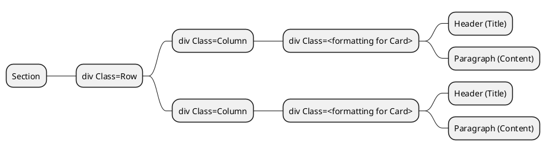

# Alans Homage to Star Trek
## Description
As a lifelong star trek fan, I've developed this page to show some appreciation for Star Trek and to illustrate some of the fun and interesting facts about the show and to answer some questions I've heard many times in the past

## Features
* responsive
* Accessible
* Bootstrap and Flex Based
* includes a carousel with both images and fun tidbits

## Accessibility notes
All pages of the sites were designed with an accessibility first approach to the structure, using semantically correct structures and ensuring that the tab order, keyboard operation and the audio navigation controlls are all working correctly.
I've also used Axe Devtools as part of the testing to ensure that the colour contrasts, fonts etc. all enable the page to be accessible by default
## tests
### Error Checking
* Open each page in Developer mode and ensure there are no errors.
  - [X] Index
  - [x] About me
  - [x] Contact
  - [x] Card 1
  - [x] Card 2
  - [x] Card 3

### Responsiveness
* Check Each page for Break points at 375 for mobile, 768 for tablet
  - [x] Index
  - [X] About me
  - [X] Contact
  - [X] Card 1
  - [x] Card 2
  - [X] Card 3

* For Phone and Tablet, ensure there is sufficient margin on X for finger access, scrolling.
  - [x] Index
  - [X] About me
  - [X] Contact
  - [X] Card 1
  - [x] Card 2
  - [X] Card 3

* for phone and Tablet, Navbar is hamburger icon and operates correctly
  - [X] Index
  - [X] About me
  - [X] Contact
  - [X] Card 1
  - [X] Card 2
  - [X] Card 3

### Accessibility
* Run AXE Devtools for each Page
  - [X] Index
  - [X] About me
  - [X] Contact
  - [X] Card 1
  - [X] Card 2
  - [X] Card 3

* Run forward Tab Order through each page
  - [X] Index
  - [X] About me
  - [X] Contact
  - [X] Card 1
  - [X] Card 2
  - [X] Card 3

* Run Reverse Tab Order through each page
  - [X] Index
  - [X] About me
  - [X] Contact
  - [X] Card 1
  - [X] Card 2
  - [X] Card 3

* Ensure 'ENTER' operation for each control on the page works
  - [X] Index
  - [X] About me
  - [x] Contact
  - [X] Card 1
  - [X] Card 2
  - [X] Card 3

* Run Narrator through each control on the srceen
  - [X] Index
  - [X] About me
  - [X] Contact
  - [X] Card 1
  - [X] Card 2
  - [X] Card 3

## General Notes / Developer log
One of the most mesmerising parts I found watching Star trek The next Generation, was the computers and panels.
These were originally made by Michael Okuda by layering underlying designs cut out of black film with backlit colored stage light filters or "gels." and became to be known as "Okudagrams". 
//https://treknews.net/wp-content/uploads/2015/07/okudagram-star-trek.jpg//

My initial idea was to treat this site as a big okudagram with the menus down the side and links and flashing buttons (Much like [The LCARS project](https://www.thelcars.com/)), but without using Javascript I've had to trim this back to some similar style buttons and panels and using the same fonts insead.

### Website Goal
To probide an accessible responsive static website that conveys a point of interest for me that I can publish.

### Plan:

### Goal
to Create a Static web page as a homage to Star Trek.
The Goal is to provide a website that meets all of the criteria for the module 1 assessment for the UCD Full Stack Development course.

Home:   The home landing page. Index.html
About:  About me.
Contact Me: EMail Contact form for me.

Main page:
Space, The final frontier
These are the voyages of the Starship Enterprise
It's mission...

Pic of Enterprise D in background.

Outline
---
Card A:     Why I Love Star Trek

Card B:     Star Trek V Star Wars

Card C:     Nerd Out

### Site Map:

### WireFrames
The wireframes for the plan were as follows:
#### Home Page

Wireframe for Home Page / index.html

#### Card A

Wireframe for Card A

#### Card B

Wireframe for Card B

#### Card C

Wireframe for Card C

## Github Repo Link
https://github.com/deadlyBuzz/UCDMod1-Assessment

## Github Pages Link 
https://deadlybuzz.github.io/UCDMod1-Assessment/

## References and Notes
The following is a list of places and pages where I obtained additional resources and help used in building this site:

### AI Refrences
AI was used extensively for the development of this project.  I used Google Gemini Search to provide ideas and to fact check some of the items i already had in my head.

The following is a detailed list of references where AI was used:

#### Introduction Paragraph
I was struggling to try and develop a clean and concise introduction to star trek.  My Passion is prohibiting me from writing cleanly so I asked Google Gemini:

> [!NOTE] 
> "Give me a brief introduction to star trek to include as a paragraph"
> Created by Gene Roddenberry, Star Trek is an iconic sci-fi franchise set in a hopeful future where humanity has overcome poverty, war, and greed. Centered on the space exploration armada known as Starfleet, the stories follow diverse crews traveling the galaxy in vessels like the USS Enterprise. Their mission is to seek out new life, expand Federation ideals, and boldly go where no one has gone before.

#### Friendy Bio
I was looking to change some of the verbage and tone of the "About me" Page and what i had at hand was very formal and CV-Ish.
I engaged in a conversation with Google Gemini to reform it, a printout that can be found [HERE](/Notes/Crafting-a-Fiendishly-Impersonal-Bio_Google_Gemini.pdf)

#### Shuttle Prop Hostory
I knew the history of the Transporter but some of the details were missing so I engaged in a conversation with Google Gemini to flesh out the details ([HERE](/Notes/star-trek-didnt-have-a-shuttle-prop.pdf))

#### Studio exec interference
The fact that the studio execs interfered with the storylines in Star trek was a big factor in how some of the stories panned out so i wanted to be sure of the data I had at hand.  This conversation with Google Gemini is detailed [HERE](/Notes/studio-execs-messed-with-the-ending.pdf)

#### Table Spacing
When looking for the syntax for table spacing in Bootstrap, a plain google search gave me everything but what I wanted, Tailwind, CSS, Javascript, everything but what I wanted, so I used "AI MODE" on google (Gemini), the details can be found [HERE](/Notes/tableSpacing-search.pdf)

##### Fonts and Colours to use
As I initially wanted to replicate the LCARS (Library Computer Access and Retrieval System) system in Star trek I used Google AI Mode (Gemini) to search for the Font and the Colour Pallet to use, though I didn't use it as rigidly as I'd hoped.  That search can be found [HERE](/Notes/what-fonts-are-used-in-Start-Trek-TNG-Computers_Google-Search.pdf)

### Image References
Self Sealing Stem Bolts: https://wiki.fed-space.com/index.php?title=Self-sealing_stem_bolt

Transporter: https://www.cbr.com/star-trek-tos-enterprise-multiple-transporter-rooms/

Studio Execs: https://www.imdb.com/title/tt1118051/mediaviewer/rm4193435136/?ref_=tt_ph_2

Colourful Bridge: https://www.reddit.com/r/GalaxyS23Ultra/comments/1ds4023/this_camera_is_really_amazing/

Enterpise Crew: https://memory-beta.fandom.com/wiki/USS_Enterprise_(NCC-1701)_personnel

Geordi Engineering: https://screenrant.com/star-trek-geordi-la-forge-complete-timeline/

Board Room: http://steveboese.squarespace.com/journal/2015/2/2/i-dont-want-to-work-with-companies-i-want-to-work-with-peopl.html;jsessionid=DD7DAB107068EE6647376468B37BFE2A.v5-web018

Star Trek Engineering Logo: https://imgbin.com/png/fBE69cXG/star-trek-starfleet-command-starship-enterprise-embroidered-patch-png
(Modified in Inkscape)

enterpise Over Promellian battle cruiser: https://cygnus-x1.net/links/lcars/epsd-TNG3-6.php

Star Trek TNG Crew: https://memory-alpha.fandom.com/wiki/Star_Trek:_The_Next_Generation?file=Star_Trek_TNG_cast.jpg

Millenium Falcon Crew: https://www.imdb.com/title/tt0076759/mediaviewer/rm2032570112/?ref_=ttmi_mi_16_2

The original Series crew laughing on the bridge:   https://www.denofgeek.com/tv/star-trek-why-we-cant-wait-to-go-back-to-the-24th-century/

### Sample code utilised
From the Courses and Lectures we had during the Module, it made sense to me to re-use some of the code we had developed through tutorials and follow-throughs and modify them to fit the use case of my Star Trek Homage site.
The following was where I utilised these samples in my website:

#### Module 1 Unit 9
The structure for the cards on the home page.
The structure used is:

#### Module 1 Unit 9
The code and layout for the NavBar, allowing it to be resized.

#### Module 1 Unit 7
To double check the implementation of screen breakpoints.

#### Module 1 Unit 13
As I worked through the code for this, it satisfied a majority of the code I needed for the contact me page so I replicated this from the working model and modified this to match the site aesthetics and to include the "Who to direct your query" section

Thank you for reading this long readme and I hope you found it informative and helpful, and that you log on to my homage page and enjoy the details.

Live long and Prosper

Alan Curley
